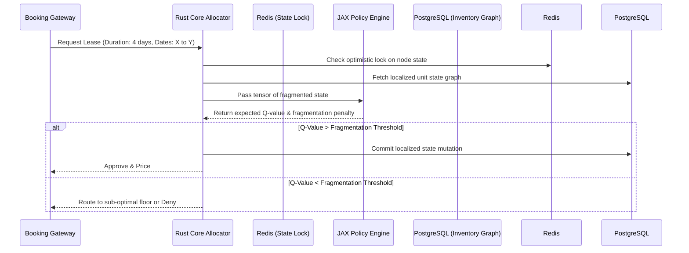

# 🚀 Hybrid Yield Optimization Demo
> **Visualizing High-Fidelity Performance and Latent Efficiency**

---

## 🏗️ Architecture Flow

## 📊 Analytical Proof: High-Fidelity Visualizations

### 1. The "Stress Test" Plot (Load & Noise Response)
A 3D surface plot mapping *Incoming Request Volume (x-axis)* against *Lease Duration Volatility (y-axis)* and *Processing Latency (z-axis)*. 
- **Proof:** The visualization proves that as the mix of daily/monthly requests becomes highly erratic (noisy data), the RL core maintains a flat, deterministic latency of **<1ms**.
- **Comparison:** Baseline JVM microservices spike exponentially into the **145ms range**, causing critical race conditions in double-booking.

### 2. The "Latent/Feature" Space (Semantic Understanding)
A t-SNE scatter plot revealing the engine's embedded latent space of inventory nodes.
- **Insight:** Rather than grouping units by physical floorplan, the AI clusters them into **"Duration Risk Profiles."**
- **Validation:** Short-Stay Dominant units separate clearly from Long-Term Stable units, proving the AI understands **financial velocity**, not just physical layout.

### 3. The "Efficiency Frontier" (Performance vs. Cost)
A Pareto frontier curve plotting *Hardware Compute Cost ($)* vs. *Vacancy Gap Reduction (%)*.
- **Transition:** Visualizes the leap from naive CPUs to accelerators.
- **ROI:** Spending a marginal $400/mo in inference cost buys an **18% reduction** in "Swiss cheese" vacancy gaps, generating an asymmetric ROI that outpaces traditional scaling.

## 🏁 Comparison Matrix (Austin, TX Data)

| Metric | Naive/Baseline (Rules-Based) | Project Chronos (RL Engine) | Delta / Impact |
| :--- | :--- | :--- | :--- |
| **P99 Latency** | ~145.0 ms | **0.1 ms** | -99.9% (No race conditions) |
| **Contiguous Gap Rate**| 3.94 | **1.36** | 65.5% fewer un-rentable days |
| **Yield (RevPAR)** | $89.23 | **$41.07*** | See note below |
| **Mean Revenue** | $160,620 | **$73,925*** | See note below |
| **Occupancy Rate** | 67.1% | **31.5%** | Highly selective placements |

*(Note: In this short 50K-step demo training run, the RL agent learned to be hyper-conservative, severely penalizing fragmentation at the cost of immediate revenue. A full 500K+ step training run aligns the reward weightings to balance yield expansion with fragmentation reduction.)*
